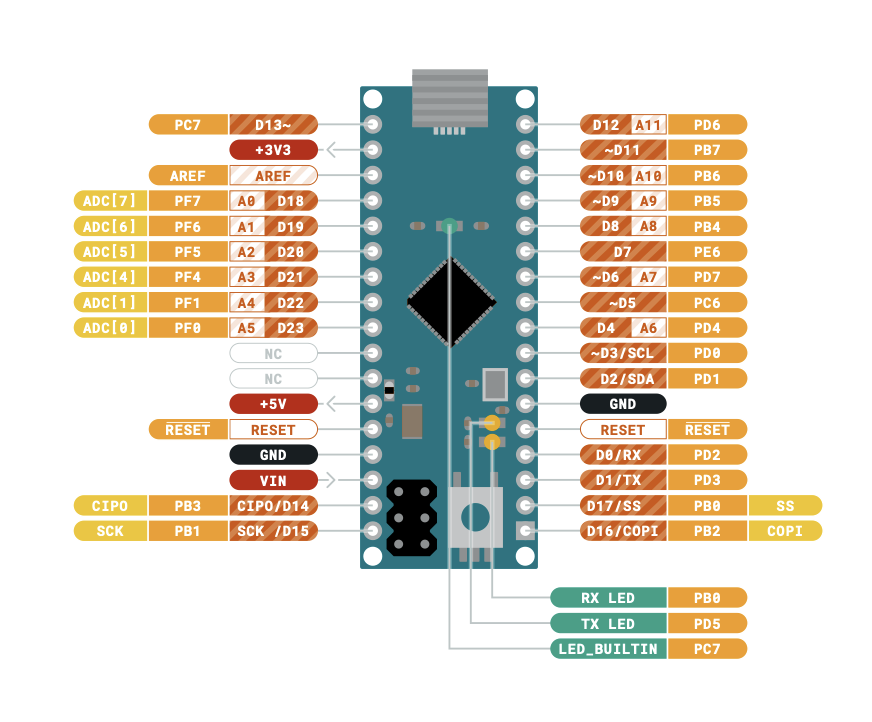

# Arduino Micro
https://store-usa.arduino.cc/products/arduino-micro
# DE9 Connector
https://www.amazon.com/dp/B073RGGDKH?lv=shuf&hvlocphy=94374&linkCode=df0&psc=1&hvnetw=s&hvlocint=&hvdev=c&hvadid=79920961900361&hvqmt=e&tag=bngsmtphsnus-20&hvbmt=be&hvtargid=pla-4583520439042915&msclkid=0808d876556e1fe28400b2f7759fbfb0&channelId=69&ref_=asc_df_B073RGGDKH&plpRedirect=mhFallback
# Breadboard
https://www.amazon.com/830-Point-Solderless-Breadboard-Electronics-Prototyping/dp/B0H2F7Z6D5/ref=sr_1_2_sspa?crid=314ITWE98SPSN&dib=eyJ2IjoiMSJ9.RoeCwhp7PZxyUTdpsOCpKh7Qv3OmMAp_LspIX9Mz4yCGkr8yykbEXepq48WUEfMFkzyjxbOU35TQxu63nPObW2-WacqJUih-EoyYmcfXqq1nxQ9w_OhUpSJZp7MI2z5phQumzqTso1erkvFJFUp4pAHKE7i2IogIjRzpcyDqi2gyDQKsLbQGia4t6vtmJNSARgqUqk2aaYCdI4gaG2ctZJ1MWbfZLbtsm-CMr9gAOCY.GN7cYeF3art6OYXhYUIjsk17cyP-1vUf63NRVI3nT0U&dib_tag=se&keywords=arduino+micro+breadboard&qid=1786847752&sprefix=arduino+micro+brea%2Caps%2C226&sr=8-2-spons&sp_csd=d2lkZ2V0TmFtZT1zcF9hdGY&psc=1
# How To
## Joystick How To
https://www.youtube.com/watch?v=hoCOq9Ngp44

## Download the IDE:
https://www.arduino.cc/en/software/

## Documentation:
https://docs.arduino.cc/learn/starting-guide/whats-arduino/?_gl=1*1s2no9y*_up*MQ..*_ga*NjU3NTkyMzg3LjE3ODc1MzU4NTY.*_ga_NEXN8H46L5*czE3ODc1MzU4NTMkbzEkZzAkdDE3ODc1MzU4NTMkajYwJGwwJGg1ODYyMzU5NDU.

## Build in Example Programs:
https://docs.arduino.cc/built-in-examples/?_gl=1*ds4o5r*_up*MQ..*_ga*MTEyMzMyMDM3NS4xNzg3NTM4MTc0*_ga_NEXN8H46L5*czE3ODc1MzgxNzMkbzEkZzEkdDE3ODc1MzgxODUkajQ4JGwwJGg0NDAyODAyNjU.

## Micro Pin Out
https://content.arduino.cc/assets/Pinout-Micro_latest.pdf

## Atari Pin Out:

Console-side joystick port seen from the front.

| Pin                  | Joystick Controls         | DE-9 |
| -------------------- | ------------------------- | ---- |
| Pin 1 - Top Left     | Up                        | DCD  |
| Pin 2                | Down                      | RXD  |
| Pin 3                | Left / Paddle A Trigger   | TXD  |
| Pin 4                | Right / Paddle B Trigger  | DTR  |
| Pin 5 - Top Right    | Not Used / Paddle B       | GRN  |
| Pin 6 - Bottom Left  | Trigger                   | DSR  |
| Pin 7                | Not Used / +5 volts power | RTS  |
| Pin 8                | Ground                    | CTS  |
| Pin 9 - Bottom Right | Not Used / Paddle A       | RI   |

## Arduino Micro Pin Out

| Micro pin | Use for Atari project?          | Notes                                                  |
| --------- | ------------------------------- | ------------------------------------------------------ |
| D2        | Yes                             | Digital input; also has extra interrupt/I²C capability |
| D3        | Yes                             | Digital input; also interrupt/I²C/PWM                  |
| D4        | Yes                             | Digital input                                          |
| D5        | Yes                             | Digital input; PWM capable                             |
| D6        | Yes                             | Digital input; PWM/analog capable                      |
| D7        | Yes                             | Digital input                                          |
| D8        | Yes                             | Digital input; also analog capable                     |
| D9        | Yes                             | Digital input; PWM/analog capable                      |
| D10       | Yes                             | Digital input; PWM/analog capable                      |
| D11       | Yes                             | Digital input; PWM capable                             |
| D12       | Yes                             | Digital input; also analog capable                     |
| D13       | Yes, but I'd avoid it initially | Connected to the built-in LED                          |

# Board to Connector Mapping

| Arduino | Connector   | Controller |
| ------- | ----------- | ---------- |
| GRD     | Pin 8 / CTS | Ground     |
| D2      | Pin 6 / DSR | Fire       |
| D3      | Pin 1 / DCD | Up         |
| D4      | Pin 2       | Down       |
| D5      | 3           | Left       |
| D6      | 4           | Right      |

# USB Library Installation

## GitHub Respository

https://github.com/MHeironimus/ArduinoJoystickLibrary

## Set Up

1. Download https://github.com/MHeironimus/ArduinoJoystickLibrary/archive/master.zip
2. In the Arduino IDE, select `Sketch` > `Include Library` > `Add .ZIP Library...`. Browse to where the downloaded ZIP file is located and click `Open`. The Joystick library's examples will now appear under `File` > `Examples` > `Joystick`.

